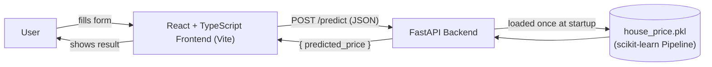

# 🏡 Real Estate Price Prediction System

An end-to-end Machine Learning web application that predicts Indian real estate prices from property features. The project pairs a **FastAPI** backend serving a trained scikit-learn model with a **React + TypeScript** frontend built on Vite.

---

## 📖 Overview

Users fill in property details (location, area, floor, bathrooms, furnishing, etc.) in the web form. The frontend sends this data to the backend API, which runs it through a pre-trained regression pipeline and returns a predicted price in real time.

The model was trained on the [House Price dataset by Juhi Bhojani](https://www.kaggle.com/datasets/juhibhojani/house-price) (~187,000 real property listings from India), after cleaning messy fields such as text-formatted prices (`"42 Lac"`, `"1.2 Cr"`) and areas (`"1200 sqft"`, `"140 sqm"`).

---

## 🏗️ Architecture



---

## 🛠️ Tech Stack

### Backend
- **Python & FastAPI** — high-performance RESTful API
- **Scikit-Learn** — pre-trained regression pipeline (`house_price.pkl`) for real-time inference
- **Pydantic** — request/response validation
- **Pytest** — unit and integration tests

### Frontend
- **React & TypeScript** — type-safe, interactive UI
- **Vite** — fast dev server and build tool
- **Oxlint** — linting

### Machine Learning
- **Pandas / NumPy** — data cleaning and feature engineering
- **Scikit-Learn** — `ColumnTransformer` + `Pipeline`, `RandomForestRegressor` and `LinearRegression`
- **Jupyter Notebook** — EDA, training, and evaluation

---

## 📂 Project Structure

> ⚠️ Update this tree to match your actual folders exactly before submitting — a stranger cloning the repo will compare this to what they see.

```text
.
├── notebooks/
│   └── house_price_model.ipynb   # EDA, cleaning, training, evaluation, export
├── backend/
│   ├── app/
│   │   ├── main.py                    # FastAPI app, CORS, lifespan model loading
│   │   ├── api/routes/prediction.py   # GET /health, POST /predict
│   │   ├── core/config.py             # Settings from .env
│   │   ├── schemas/prediction.py      # PredictionRequest / PredictionResponse
│   │   ├── services/
│   │   │   ├── preprocessing.py       # Request → one-row DataFrame
│   │   │   └── inference.py           # Load .pkl, run predict
│   │   └── utils/logging_config.py
│   ├── models/house_price.pkl         # Trained model (copied from the notebook)
│   ├── tests/test_prediction.py
│   ├── requirements.txt
│   ├── .env.example
│   └── Dockerfile
├── frontend/
│   ├── src/
│   │   ├── api/predictionClient.ts
│   │   ├── components/PredictionForm.tsx
│   │   ├── pages/ (HomePage, ResultPage, NotFoundPage)
│   │   └── types/prediction.ts
│   ├── public/
│   ├── index.html
│   ├── package.json
│   ├── .env.example
│   └── vite.config.ts
└── README.md
```

---

## 📊 Dataset

- **Source:** [House Price by Juhi Bhojani — Kaggle](https://www.kaggle.com/datasets/juhibhojani/house-price)
- **Size:** ~187,000 rows of property listings from India
- The raw CSV is **not committed** to this repo (too large). Download it yourself:

```bash
pip install kaggle
# Get an API token: Kaggle → Settings → API → "Create New Token"
# Place kaggle.json in ~/.kaggle/ (macOS/Linux) or C:\Users\<you>\.kaggle\ (Windows)
kaggle datasets download -d juhibhojani/house-price -p notebooks/data --unzip
```

---

## 🚀 Getting Started

### Prerequisites
| Tool | Minimum version |
|---|---|
| Python | 3.11 |
| Node.js + npm | 18 |
| Git | any recent |

### 1. Clone the repo
```bash
git clone https://github.com/<your-username>/house-price-app.git
cd house-price-app
```

### 2. Backend setup
```bash
cd backend
python -m venv .venv
source .venv/bin/activate      # Windows: .venv\Scripts\activate
pip install -r requirements.txt
cp .env.example .env
uvicorn app.main:app --reload
```
The API runs at `http://localhost:8000` (docs at `/docs`).

### 3. Frontend setup
```bash
cd frontend
npm install
cp .env.example .env
npm run dev
```
The app runs at `http://localhost:5173`.

### 4. Try it
Open `http://localhost:5173`, fill in the form, and submit — you should see a real predicted price.

---

## 🔑 Environment Variables

**backend/.env**
| Variable | Example | Description |
|---|---|---|
| `MODEL_PATH` | `models/house_price.pkl` | Path to the trained model file |
| `ALLOWED_ORIGINS` | `http://localhost:5173` | CORS-allowed frontend origin |

**frontend/.env**
| Variable | Example | Description |
|---|---|---|
| `VITE_API_BASE_URL` | `http://localhost:8000` | Base URL of the FastAPI backend |

---

## 🔌 API Reference

### `GET /health`
Returns service status.
```bash
curl http://localhost:8000/health
```
```json
{ "status": "ok" }
```

### `POST /predict`
Runs inference on a single property.

**Request body**
```json
{
  "location": "Whitefield, Bangalore",
  "carpet_area_sqft": 1200,
  "floor_num": 3,
  "bathroom": 2,
  "balcony": 1,
  "furnishing": "Semi-Furnished",
  "transaction": "Resale",
  "ownership": "Freehold",
  "facing": "East"
}
```

**curl example**
```bash
curl -X POST http://localhost:8000/predict \
  -H "Content-Type: application/json" \
  -d '{
    "location": "Whitefield, Bangalore",
    "carpet_area_sqft": 1200,
    "floor_num": 3,
    "bathroom": 2,
    "balcony": 1,
    "furnishing": "Semi-Furnished",
    "transaction": "Resale",
    "ownership": "Freehold",
    "facing": "East"
  }'
```

**Response**
```json
{ "predicted_price": 4250000.0 }
```

---

## 📈 Model Performance

> Fill in with your actual notebook results (test set, not training set).

| Model | MAE | RMSE | R² |
|---|---|---|---|
| Linear Regression (baseline) | *TBD* | *TBD* | *TBD* |
| Random Forest Regressor | *TBD* | *TBD* | *TBD* |

**Chosen model:** *(state which model you picked and why, in 1 short paragraph)*

---

## 🖼️ Screenshots

**Home page**


**Prediction result**


---

## ✅ Notes

- `.venv/`, `node_modules/`, `.env`, and the raw dataset CSV are excluded via `.gitignore` and must never be committed.
- The `house_price.pkl` model is committed only because it is under 50 MB.
